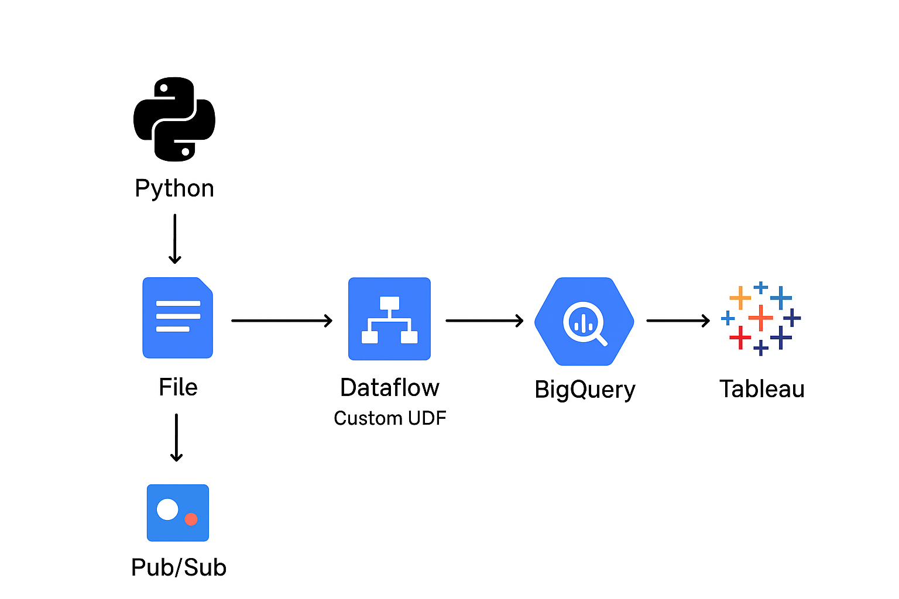

# Real-Time Air Quality Monitoring Pipeline (Accra)
### Overview
Built a real-time data streaming pipeline to monitor air quality across the city of Accra, using simulated IoT sensor data. The system ingests, transforms, stores, and visualizes environmental data (PM2.5, PM10, CO, NO₂, O₃, temperature, humidity) in real time.

**Source:** IoT sensors in cities stream air quality data (timestamp, location, PM2.5, PM10, CO, NO2, O3, temperature and humidity levels every few seconds)

- In this project I used Pub/sub to BigQuery 
  
The Pub/sub template is a streaming pipeline that can read JSON-formatted messages from a Pub/Sub topic and write them to a BigQuery table 

**Pipeline:**  
IoT Sensors (Simulated) ➡️ Pub/Sub ➡️ Dataflow (UDF Transform) ➡️ BigQuery ➡️ Tableau Dashboard

**Impact:** To demonstrate how smart cities can monitor environmental conditions and trigger alerts when pollution thresholds are exceeded.

**Workflow Chart**


- Pub/Sub topic in JSON format used;
```JSON  
{"timestamp":1672531200000,

"location":"Accra",

"PM2_5":41.3,

"PM10":12.56,

"NO2":13.65,

"CO":2.57,

"O3":131.05,

"temperature":26.6,

"humidity":71.6}

```
IoT sensors (or the software that manages it, like Raspberry Pi, Arduino, or edge gateway) sends HTTP or gRPC request to Pub/Sub APIs.

For this project I did not have a real-time streaming data from any IoT sensor so I used a local file as a streaming source **(batch-to-stream trick)**

Python script to read the file line by line and publish each row into Pub/Sub (with a delay e.g., 1 sec per row). These mimics streaming, even though the source is a static file.

**Enabling APIs (Project Selector)**

Google Cloud Storage uses APIs to communicate and to create a communication. All necessary APIs were enabled.
- Dataflow
- Compute Engine
- Cloud Logging
- Cloud Storage
- Google Cloud Storage JSON
- BigQuery
- Pub/Sub
- Resource Manager

**Enable Roles:(Go to IAM)**
Note: The "Include Google-provided role grants" *ensures Dataflow runs smoothly without me worrying about every micro-permission* 
1. User Account
- Dataflow Admin
- Service Account User
  
2. Grant access
Compute Engine default service account email: 527899781926-compute@developer.gserviceaccount.com
*This is an automatically specially created account by Google when you create a google cloud project.*
- Dataflow worker role
- Storage Object Admin role
- Pub/sub editor role
- BigQuery data editor role
- Viewer role
  
**Security:** you can also replace the default Compute Engine account with a customer service account for Dataflow Pipelines. It’s one best practice to show security awareness.

Save

**Create a cloud storage bucket**
Create a cloud storage bucket for Dataflow for temporary files, staging files, and sometimes pipeline output.
*Entered a unique bucket name. No sensitive information because the bucket name space in global and publicly visible.*
- Confirm: Public access prevention on this bucket

*Copy the following needed for the later section;*
*- Cloud Storage Bucket name*
*- Google Cloud Project ID*

**Create a BigQuery Dataset and Table**
- Create dataset
- Create an empty table for dataset: *air_quality*, *schema:edit as text*, *partition by field-timestamp*
  
*Create appropriate schema to match the structure of the incoming Pub/Sub data*

**Shema:** This references the topic (incoming data) schema
```    
timestamp:timestamp,

location: string,

PM2.5: float,

PM10:float,

NO2:float,

CO:float,

O3:float,

temperature:float,

humidity:float

```
**Running The Pipeline**
Test Dataflow before Running: 
- Use DirectRunner(Local Testing): Apache Beam provides DirectRunner, which runs my pipeline locally on my machine (no dataflow, no costs).
- Use Small Sample Data: Instead of real Pub/Sub streams, I created a fake dataset (like a JSON file with 10-20 records)
  
The pipeline gets incoming data from the input topic

```python
# Batch-to-stream simulator with Pub/Sub
import time # adds a delay between sending messages (so it feels like real-time data).
import json
from google.cloud import pubsub_v1 # is the official Google Cloud library for interacting with Pub/Sub.

# Pub/Sub configuration
project_id = "tekstain-25"
topic_id = "air-quality"

publisher = pubsub_v1.PublisherClient() # Connects your script to Pub/Sub.
topic_path = publisher.topic_path(tekstain-25, air-quality) 

# Input file (each line is one "event")
input_file = "air_quality_data.jsonl"  # This is your local data file (static data)

# Publish line by line with delay
with open(input_file, "r") as f: 
    for line in f:  # Reads one record at a time (like a sensor message), Skips empty lines.
        line = line.strip()
        if not line:
            continue

        # Convert to bytes (Pub/Sub requires bytes)
        data = line.encode("utf-8") # Converts your JSON line to bytes (Pub/Sub requires that)
        future = publisher.publish(topic_path, data) # Publishes the message to the Pub/Sub topic.
        print(f"Published message ID: {future.result()}") # Prints the message ID so you know it was sent successfully.

        # Delay between messages to mimic streaming
        time.sleep(1)  # 1 second per event, Mimics how real IoT sensors send data every few seconds.
```

```python
# Multi-device IoT stream simulator (Python)
import time
import json
import random
from datetime import datetime
from google.cloud import pubsub_v1

# Pub/Sub configuration
project_id = "tekstain-25"
topic_id = "air-quality"

publisher = pubsub_v1.PublisherClient()
topic_path = publisher.topic_path(tekstain-25, air-quality)

# Simulated IoT devices
device_ids = [f"device-{i}" for i in range(1, 6)]  # device-1 ... device-5

# Input file (one row = one payload)
input_file = "air_quality_data.jsonl"  # or .csv

with open(input_file, "r") as f:
    for line in f:
        line = line.strip()
        if not line:
            continue

        # Choose a random device
        device_id = random.choice(device_ids)

        # Build IoT-style message
        message = {
            "device_id": device_id,
            "timestamp": datetime.utcnow().isoformat() + "Z",
            "payload": json.loads(line) if line.startswith("{") else {"raw": line}
        }

        # Publish to Pub/Sub
        data = json.dumps(message).encode("utf-8")
        future = publisher.publish(topic_path, data)
        print(f"Published from {device_id}, message ID: {future.result()}")

        # Delay between events
        time.sleep(1)  # 1 second per simulated event
```


**Go to Jobs**
- Create job from template
- Job name: air-data
- Template: Pub/Sub to BigQuery template
- BigQuery output table: tekstain-25:pollution.air_quality 
- Input Pub/Sub topic: Enter topic manually 
- Save: 
- Temp location: gs://teckflow_bucket/temp/
- Network, subnetwork
- Run Job

**Step	Task	When to Run**
- **1–3**	Setup (project, IAM, BigQuery)	One-time setup
- **4**	Create Pub/Sub topic	Before running Python script
- **6**	Run Python publisher	After creating topic, before Dataflow
- **7**	Start Dataflow job	After topic and script are ready
- **8–9**	Monitor BigQuery + Visualize	While pipeline is running

**View Results**

Go to BigQuery page

**Dashboard:** 

Tableau showing city-level pollution dashboard made of different charts, alerts when thresholds are exceeded. 

- Tableau can’t connect directly to Pub/Sub or Dataflow.It connects to BigQuery, where your final, cleaned data is stored.
- Before connecting Tableau, make sure there’s at least some data already written into your BigQuery table ,even a few records.

**Using Tableau Desktop:**

- Open Tableau.

- On the start page, click Connect → To a Server → Google BigQuery.

- Sign in with your Google account (same one used in your GCP project).

- Tableau will show your Google Cloud projects.

- Choose your project (e.g., tekstain-25).

- Expand the project → dataset → select your table (e.g., pollution.air_quality).

- Click Connect and then Load Data.

*Now Tableau will pull a snapshot of your BigQuery data into its workspace.*

Note: *For real-time streaming dashboards, Choose Live Connection, Tableau keeps a direct link to BigQuery and queries it every few seconds/minutes.*
 
**Build Your First Dashboard**

#### 1. Drag Fields into Rows & Columns

 - X-axis (Columns): timestamp, Y-axis (Rows): PM2_5

#### 2. Add More Charts

- Heatmap ➡️ location vs pollutant (color shows intensity)

- Gauge or KPI card ➡️ average PM2.5 or CO

- Line chart ➡️ trends for NO₂ or temperature

#### 3. Add Filters or Parameters

- Dropdown for location (e.g., Accra)

- Slider for time window (last hour, last 24 hours)

#### 4. Combine into a Dashboard

- Click New Dashboard, then drag your individual charts into it.
- Arrange them however you like.

**Create Alerts in Tableau**

- Publish your dashboard to Tableau Server or Tableau Cloud.

- Create a Data-Driven Alert (e.g., PM2.5 > 35 µg/m³).

- Tableau can send an email alert when the condition is met.
